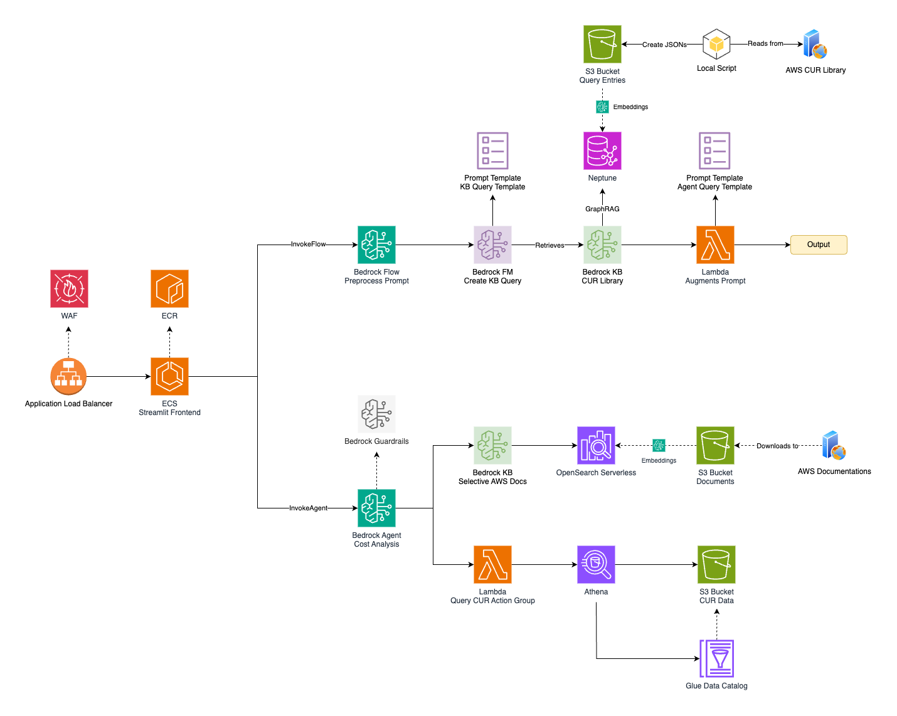

# GenAI-Powered Cost Analysis - AWS Summit Bangkok 2025

This repository contains reference code for the "GenAI-Powered Cost Analysis" demo presented at AWS Summit Bangkok 2025. This chatbot application demonstrates how generative AI can be leveraged to analyze AWS cost data using Amazon Bedrock.

## Important Disclaimers

> **This repository is provided for reference purposes only.**

- This code is a simplified version of the demo application shown at the event.
- It is not intended for production use without significant modification and proper security review.
- Many backend components were manually created through the AWS Console and are not included in this codebase.

## Architecture Overview



### Components by Folder

#### Frontend (`frontend/` folder)
- **Streamlit Frontend**: Implemented in `frontend/app.py`
- **Application Load Balancer**: Defined in `infra/ecs.yaml`
- **Web Application Firewall (WAF)**: Defined in `infra/ecs.yaml`

#### Backend (`backend/` folder)
- **Lambda Functions**:
  - **Lambda Augment Prompt**: Implemented in `backend/functions/format-agent-prompt/`
  - **Lambda Query CUR Action Group**: Implemented in `backend/functions/analyze-cur/`
- **Helper Layer**: Implemented in `backend/functions/layers/helper-layer/`

#### Prompts & Templates (`from-aws/` folder)
- **Prompt Template KB Query Template**: From `from-aws/bedrock/prompt-management/cur-library-kb-template.txt`
- **Prompt Template Agent Query Template**: From `from-aws/bedrock/prompt-management/agent-template.xml`

### Pre-existing Resources (Need to be created beforehand)

1. **Amazon Bedrock Resources**:
   - Bedrock Flow (created via AWS Console)
   - Bedrock Foundation Model (AWS managed)
   - Bedrock Knowledge Base (created via AWS Console)
   - Bedrock Guardrails (created via AWS Console)
   - Bedrock Agent (created via AWS Console)

2. **Storage Resources**:
   - S3 Bucket for Athena Query Results
   - S3 Bucket for Cost and Usage Report (CUR) Data 
   - S3 Bucket for Knowledge Base Documents
   - Glue Data Catalog

3. **Query & Analysis Components**:
   - Amazon Athena service
   - AWS Cost and Usage Reports configuration

The application utilizes:

- **Amazon Bedrock**: Powers the core conversational AI capabilities
  - Bedrock Agent: Handles natural language queries about AWS costs
  - Bedrock Knowledge Base: Contains information about cost patterns and query examples
  - Bedrock Flow: Orchestrates the conversation flow and data preparation
- **AWS Lambda**: For serverless compute functions that:
  - Analyze Cost and Usage Reports data via Athena
  - Format and enhance agent prompts
- **Amazon Athena**: To query structured AWS cost data stored in S3
- **Streamlit Frontend**: Web UI for interacting with the cost analysis chatbot

## Repository Structure

```
backend/
  ├── functions/               # AWS Lambda function implementations
  │   ├── analyze-cur/         # Function to analyze cost data through Athena
  │   ├── format-agent-prompt/ # Function to format Bedrock agent prompts
  │   └── layers/              # Shared code layers for Lambda functions
  └── template.yaml           # SAM template for Lambda resources

frontend/
  ├── app.py                  # Streamlit application for the web UI
  ├── dockerfile              # Container definition for frontend deployment
  ├── requirements.txt        # Python dependencies for the frontend
  └── utils/                  # Utility functions for the frontend

infra/
  └── *.yaml                  # Infrastructure templates for deployment
```

## Missing Pieces (Not Included in Repository)

This repository **does not** include:

1. **Amazon Bedrock Resources**: These were created manually through the AWS Console:
   - Agent configuration and action groups
   - Knowledge Base setup and documents
   - Flow definitions
   - Prompt templates

2. **AWS IAM Roles and Permissions**: Required permissions are referenced in the SAM template but not fully defined

3. **AWS Cost and Usage Report Configuration**: Details on setting up and formatting CUR data

## Prerequisites for Running Similar Applications

To implement a similar solution, you would need:

1. AWS Account with access to Amazon Bedrock
2. Configured Cost and Usage Reports with data in S3
3. Amazon Athena set up to query these reports
4. Properly configured IAM roles and permissions
5. Bedrock Agent, Knowledge Base, and Flow resources

## Environment Variables

The application requires several environment variables to be set:

### Backend (Lambda Functions)
- `ATHENA_CATALOG`, `ATHENA_DATABASE`, `ATHENA_WORKGROUP`: Athena configuration
- `BEDROCK_PROMPT_ID`, `BEDROCK_PROMPT_VERSION`: Bedrock prompt template references

### Frontend (Streamlit App)
- `AWS_REGION`: AWS region where resources are deployed
- `BEDROCK_FLOW_ID`, `BEDROCK_FLOW_ALIAS_ID`: References to the Bedrock Flow
- `BEDROCK_AGENT_ID`, `BEDROCK_AGENT_ALIAS_ID`: References to the Bedrock Agent
- `SSM_PASSWORD_PARAM`: Optional SSM parameter name for demo password

## License

This project is licensed under the MIT License - see the LICENSE file for details.

## Disclaimer

THIS SOFTWARE IS PROVIDED "AS IS" AND ANY EXPRESSED OR IMPLIED WARRANTIES, INCLUDING, BUT NOT LIMITED TO, THE IMPLIED WARRANTIES OF MERCHANTABILITY AND FITNESS FOR A PARTICULAR PURPOSE ARE DISCLAIMED.